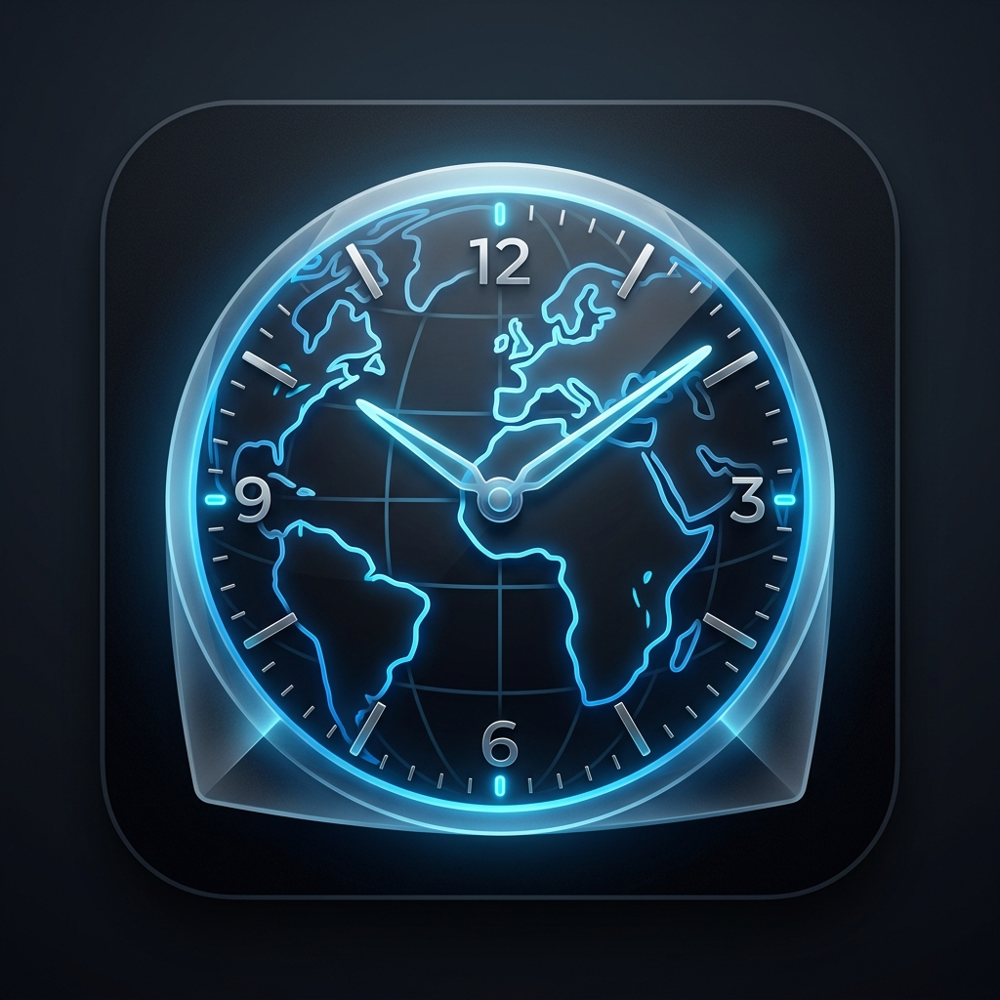

# 🕰️ Reloj Mundial PatagonIA

¡Bienvenido a **Reloj Mundial PatagonIA**! Una aplicación de escritorio elegante, minimalista y potente diseñada para quienes necesitan gestionar múltiples zonas horarias sin perder el estilo.



## ✨ Características Principales

*   **🌍 Relojes Globales**: Agregá cualquier ciudad del mundo. Los nombres se traducen y formatean automáticamente para una mejor lectura.
*   **🍅 Temporizador de Enfoque (Pomodoro)**: Configurá sesiones de trabajo y recibí alertas visuales y sonoras cuando termines.
*   **📊 Conversor Horario**: Calculadora inteligente para saber qué hora será en otro país en un momento específico, gestionando automáticamente los cambios de horario de verano (DST).
*   **📌 Siempre al Frente**: Fijá la ventana para que nunca se pierda detrás de tus otras aplicaciones.
*   **💎 Diseño Premium**: Interfaz con efecto de desenfoque (Glassmorphism), transiciones suaves y controles personalizados.
*   **📏 Ventana Redimensionable**: Ajustá el tamaño de la aplicación según tus necesidades.

## 🚀 Cómo Usar el Programa (Comunidad Skoll)

Si solo querés usar el programa:
1.  Descargá la última versión desde la sección de [Releases](https://github.com/TU_USUARIO/reloj-de-escritorio/releases).
2.  Ejecutá el archivo `Reloj de Escritorio Setup.exe`.
3.  ¡Listo! Ya tenés tu reloj en el escritorio.

## 🛠️ Desarrollo (Para avanzados)

Si querés modificar el código o compilarlo vos mismo:

### Requisitos
*   [Node.js](https://nodejs.org/) instalado.

### Instalación
```bash
# Clonar el repositorio
git clone https://github.com/jsarovic/reloj-de-escritorio.git

# Instalar dependencias
npm install

# Iniciar en modo desarrollo
npm start
```

### Compilación (Generar el .exe)
```bash
npm run dist
```

## 📜 Licencia
Este proyecto fue desarrollado con ❤️ para la comunidad de **Skoll**. Licenciado bajo ISC.

---
*Desarrollado por [Tu Nombre/Agencia]*
